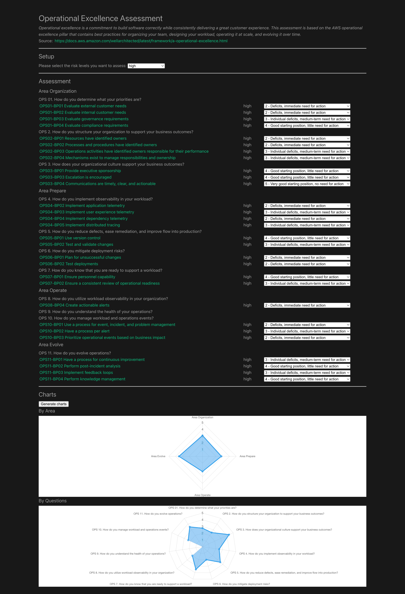

# Operational excellence assessment

[](https://github.com/lakermann/operational-excellence-assessment-service-fe/actions/workflows/ci.yml)
[](https://github.com/lakermann/operational-excellence-assessment-service-fe/actions/workflows/cd.yml)

_by [Lukas Akermann](https://github.com/lakermann)_

Operational excellence is a commitment to build software correctly while consistently delivering a great customer
experience. This assessment is based on the AWS operational excellence pillar that contains best practices for
organizing your team, designing your workload, operating it at scale, and evolving it over time.

* <https://lakermann.github.io/operational-excellence-assessment-service-fe/>



___

## Development

Project Setup

```sh
npm install
```

Compile and Hot-Reload for Development

```sh
npm run dev
```

Type-Check, Compile and Minify for Production

```sh
npm run build
```

Lint with [ESLint](https://eslint.org/)

```sh
npm run lint
```

Format with [Prettier](https://prettier.io/)

```sh
npm run format
```
